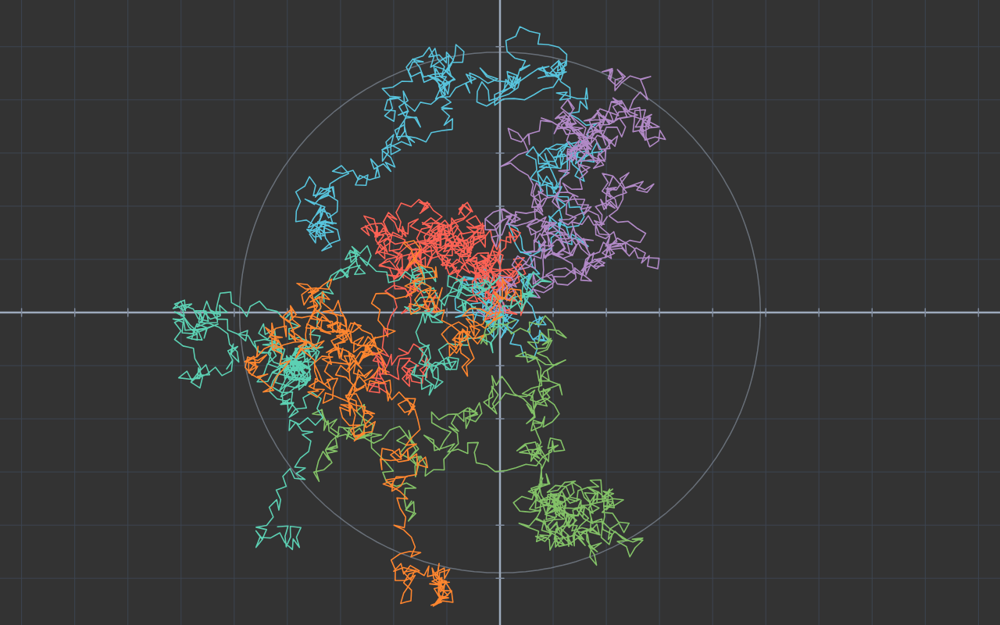
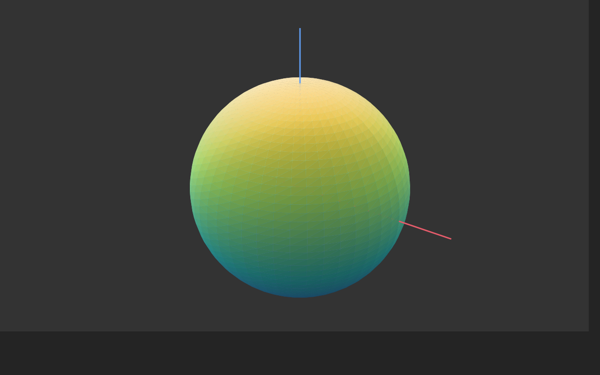
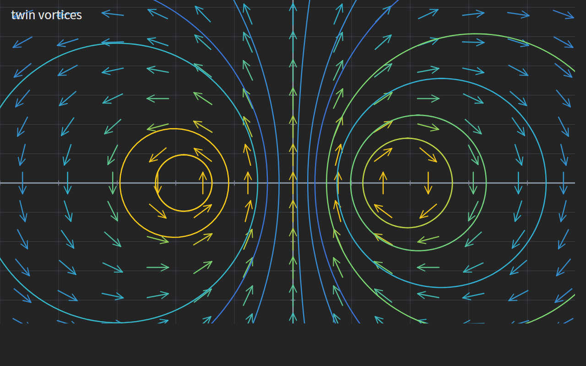

# manim-ui

**把 [3b1b/manim](https://github.com/3b1b/manim) 的着色器搬进浏览器，做成一个随开随用的数学可视化工具。**

manim 是 3Blue1Brown 用来做数学动画的引擎，它内部用 WGSL 写了一套 GPU 着色器。
本项目把这些着色器**原样拿过来（一个字节都没改）**，在浏览器 WebGPU 上跑起来，
于是"数学可视化"变成了一个双击就能打开的本地网页：不装 Python 之外的任何东西、
不联网、不上传数据、不需要显卡驱动以外的配置。

纯前端 + 一个零依赖的 Python 静态服务器。中英双语界面（右上角 中 / EN 切换，语言自动记忆）。

|  |  |
|---|---|
|  |  |
| 随机游走 —— 灰圈是 √n 标度 | 三维球面 —— 上游 surface.wgsl 现推网格 |
|  |  |
| 双涡向量场 —— 颜色编码速率 | 中心极限定理 —— 直方图长成钟形 |

---

## 目录

- [它是什么](#它是什么)
- [功能一览](#功能一览)
- [环境要求](#环境要求)
- [安装与启动](#安装与启动)
- [界面总览](#界面总览)
- [功能详解](#功能详解)
  - [1. 分形实验室](#1-分形实验室)
  - [2. 函数绘图器](#2-函数绘图器)
  - [3. 向量场流线](#3-向量场流线)
  - [4. 三维几何](#4-三维几何)
  - [5. 随机过程](#5-随机过程)
- [导出 PNG](#导出-png)
- [录制视频](#录制视频webm)
- [常见问题](#常见问题)
- [目录结构](#目录结构)
- [二次开发：加一个自己的模块](#二次开发加一个自己的模块)
- [实现要点](#实现要点)
- [踩坑记录](#踩坑记录)
- [支持作者](#支持作者-)
- [许可](#许可)
- [English Quick Start](#english-quick-start)

---

## 它是什么

一句话：**manim 的渲染层 + 一个普通网页的外壳。**

- **上游着色器零改写**：`shaders/` 下的 23 个 `.wgsl` 文件取自 3b1b/manim，未做任何修改。
  浏览器端复刻了上游 `shader_source.py` 的模板机制（`#INSERT` 递归展开、`// DATA_LAYOUT`
  等占位符注入、源码级常量替换），所以同一份上游源码能编译出多个不同的管线。
- **重写了上游的"接线"**：uniform 布局、VMobject 记录缓冲、模板缓冲数绕数的填充通路、
  相机、交互控件——这些原本在 Python 里做的事情，这里用 JavaScript 按同样的约定重做了一遍。
- **面向使用者，不面向开发者**：每个模块都有一排"预设场景"，点一下就能看到结果，
  再拖滑块去理解参数。不需要先懂 WebGPU 或 manim 的任何概念。

## 功能一览

侧栏共 **5 个模块**、**22 个预设场景**：

| 模块 | 预设数 | 能做什么 |
|---|---|---|
| **分形实验室** | 6 | 曼德博集合、朱利亚集合（可实时变形）、牛顿迭代法分形，可无限放大 |
| **函数绘图器** | 5 | 三角函数、二次函数、黎曼和、曲线下面积 + **自定义函数**（安全表达式解析）；真正的填充（模板缓冲数绕数） |
| **向量场流线** | 4 | 涡旋 / 吸引子 / 偶极子 / 双涡的箭头场 + RK4 流线，颜色编码速率 |
| **三维几何** | 4 | 球面 / 环面 / 莫比乌斯带 / 正二十面体，鼠标轨道旋转 + 透视投影 |
| **随机过程** | 3 | 大数定律、中心极限定理、随机游走，全部种子化、可复现 |

通用能力：中英双语、参数实时调节、拖拽平移 / 滚轮缩放 / 双击复位、
一键导出 PNG（离屏读回，不是截屏）、逐帧播放动画、**一键录制 WebM 视频**。

## 环境要求

| 项 | 要求 | 说明 |
|---|---|---|
| 浏览器 | **Edge 113+** 或 **Chrome 113+** | 必须支持 WebGPU；Firefox / Safari 目前不行 |
| 显卡 | 任意 WebGPU 兼容显卡 | 集显足够。本项目在 Intel UHD 630 集显上实测流畅 |
| 操作系统 | Windows / macOS / Linux | 一键启动脚本只写了 Windows 的 `.bat`，其他系统用命令行启动（见下） |
| Python | **3.8+**，且**无第三方依赖** | 仅用来起本地静态服务器。不需要 numpy / matplotlib / manim |

> 本项目**不需要安装 manim、不需要 CUDA、不需要 Node**。Python 只负责发文件。

## 安装与启动

### 步骤 1：装 Python（只需一次）

确认机器上有没有 Python：

```sh
python --version
```

没装的话去 <https://www.python.org/downloads/> 下载 3.8 以上版本，
**安装时务必勾选 `Add Python to PATH`**（不勾的话启动脚本找不到它）。

### 步骤 2：拿到代码

```sh
git clone https://github.com/wyfirstname/manim-ui.git
cd manim-ui
```

或者直接下载 ZIP 解压，效果一样。

### 步骤 3：启动

**Windows**：双击 **`启动.bat`**。脚本会自己找 `python` 或 `py -3`，
起服务并自动打开浏览器。看到命令行打印出

```
  地址：http://127.0.0.1:7788/
```

就说明服务起来了。关掉那个黑窗口 = 关闭服务。

**macOS / Linux / 或者想自己控制端口**：

```sh
python server/serve.py                 # 默认 7788，自动开浏览器
python server/serve.py --port 9000     # 换端口（被占用会自动顺延）
python server/serve.py --no-browser    # 不自动开浏览器
```

浏览器打开 `http://127.0.0.1:7788/` 即可。左栏"运行环境"那一栏会显示检测到的 GPU 名称。

> ### ⚠️ 必须通过启动器打开，不要双击 `web/index.html`
>
> WebGPU 规范要求**安全上下文**（HTTPS 或 `http://localhost`）。
> 用 `file://` 直接打开 HTML 时，浏览器会**直接把 `navigator.gpu` 藏掉**，
> 页面于是报"这台机器不支持 WebGPU"——**这是误导性的错误提示，不是你的显卡有问题**。
> 本项目在检测到这种情况时会专门给出"不在安全上下文中"的提示，而不是笼统地说不支持。

## 界面总览

```
┌──────────────┬────────────────────────────┬──────────────┐
│  模块切换    │                            │   参数调节   │
│  预设场景    │         画布 (WebGPU)       │   滑块 / 勾选 │
│  运行环境    │                            │   导出/重置/播放│
└──────────────┴────────────────────────────┴──────────────┘
```

- **左栏**：模块标签页 → 该模块的预设场景卡片（点一下切换）→ 运行环境（GPU 名称与启动日志）。
  左上角标题旁的 **中 / EN** 切换整个界面语言，选择会记在 localStorage 里。
- **中栏**：渲染画布。画布左下角会常驻显示当前模块的鼠标操作提示。
- **右栏**：参数面板。面板内容是**跟着模块和预设变的**——选"黎曼和"才会出现"矩形数"滑块，
  选"正弦与余弦"就不会显示"填充不透明度"。下面四个按钮：
  - **导出 PNG**：见 [导出 PNG](#导出-png)
  - **重置视图**：把参数恢复成当前预设的初始值（缩放、平移、滑块全部复位）
  - **▶ 播放**：进入动画模式，按钮变成"⏸ 暂停"。每 16 ms 推进一帧，各模块播放的含义不同（见下文）。
    模块没有实现播放时按钮是灰的。
  - **● 录制动画**：把动画录成 WebM 视频，见 [录制视频](#录制视频webm)

### 通用鼠标操作

| 操作 | 分形 / 绘图器 / 向量场 / 随机过程 | 三维几何 |
|---|---|---|
| 拖拽 | 平移视野 | 转动物体（轨道旋转） |
| 滚轮 | **以光标为锚点**缩放 | 推近 / 拉远 |
| 双击 | 重置视野 | 回到预设视角 |

"以光标为锚点"的意思是：光标底下的那个点在缩放前后**位置不变**，
所以你可以对着分形边界的某个细节一直滚轮放大，它不会跑掉。

## 功能详解

下面按侧栏顺序，把每个模块的**每个预设、每个滑块的取值范围与含义、播放行为**都列出来。

---

### 1. 分形实验室

用上游 `mandelbrot_fractal.wgsl` 与 `newton_fractal.wgsl` 渲染。整个画布其实只是一个矩形，
每个像素在着色器里自己做迭代——所以放大到任意倍数都不糊。

#### 预设

| 预设 | 内容 |
|---|---|
| **曼德博集合** | z ← z² + c，c 扫过整个平面。经典形状，边界处无限自相似 |
| **朱利亚集合** | c 固定、初值 z₀ 扫过平面。默认 c = −0.4 + 0.6i |
| **朱利亚 · 兔形** | c = −0.123 + 0.745i，"Douady 兔子"，有三只耳朵的连通分形 |
| **朱利亚 · 仙人掌** | c = 0.285 + 0.01i，结构非常细碎 |
| **曼德博 · 放大** | 已经放大到 1/50 的曼德博边界——**放大之后还是自相似** |
| **牛顿迭代法** | 解 z³ − 1 = 0：三个根各占一片"吸引域"，交界处同样是分形 |

#### 参数

| 滑块 | 范围 | 作用 |
|---|---|---|
| **迭代步数** | 8 – 300 | 每个像素最多迭代几次。调大 = 边界更清晰但更吃显卡；调小 = 快但边缘糙 |
| **实部 c** | −1.5 – 1.5 | **仅朱利亚模式出现**。拖动它，朱利亚集合会实时变形 |
| **虚部 c** | −1.5 – 1.5 | 同上，两个滑块一起构成复平面上的 c |
| **缩放** | 1/200 – 3× | 显示成 `1/N` 形式。滚轮改变时这个滑块会同步 |

#### 交互与播放

- 拖拽平移、滚轮以光标为锚点缩放、双击复位。
- **播放**：每帧把缩放乘 0.995，也就是**缓慢自动放大**——这是演示自相似性最直观的方式。
  你想盯着某个位置看，随时按暂停。

#### 建议的探索路线

1. 选**曼德博集合**，把光标放在黑色主体边缘的某条"触须"上，一路滚轮放大，
   你会不停遇到和海马谷一样的小曼德博集合。
2. 选**朱利亚集合**，慢慢拖虚部滑块从 0 到 1，看图形从"一片连通"碎成一团尘埃再聚成兔子。
3. 选**牛顿迭代法**，放大三个颜色区域交界的地方——那里也长着自相似结构。

---

### 2. 函数绘图器

用上游 `stroke.wgsl`（画线）和 `fill.wgsl`（画填充）画坐标轴、曲线、矩形与面积。
坐标轴 / 网格 / 刻度的间距按"好看的步长"（1 / 2 / 5 × 10ᵏ）自动选取。

#### 预设

| 预设 | 画什么 |
|---|---|
| **正弦与余弦** | y = a·sin(bx + c) 与 y = a·cos(bx + c) 两条曲线，蓝黄两色 |
| **二次函数** | y = a·x² + b·x + c |
| **黎曼和 · 定积分** | y = x² 在 [0, 2] 上的黎曼和，矩形**真正被填充** |
| **曲线下的面积** | y = x² 从 0 积到 b 的填充面积，上限处有红色竖线标记 |
| **自定义函数** | 你自己写的表达式，见下节 |

#### 自定义函数

选「自定义函数」预设后，右栏顶部会出现一个**函数表达式输入框**，边输入边重画：

- 变量：`x`，以及**绑定到系数滑块**的 `a`、`b`、`c` —— 写 `a*sin(b*x+c)`，
  然后拖三个滑块就能实时改振幅 / 频率 / 相位；播放时 `c` 会滚动，波形平移
- 写法：`+ − × ÷ ^`（幂）、括号、`√` 前缀、隐式乘法（`2x`、`3sin(x)`、`(x+1)(x-1)` 都行）；
  常量 `pi` `π` `e` `tau`
- 函数：`sin cos tan asin acos atan sinh cosh tanh exp ln log log2 log10 sqrt cbrt
  abs sign floor ceil round min max pow atan2 hypot mod`。
  **注意 `ln` 是自然对数，`log` 是以 10 为底**（与 Desmos / GeoGebra 一致）
- 渐近线安全：`tan(x)`、`ln(x)` 在无定义处会自动断开，不会画出竖直的假线；
  `1/0`、`sqrt(-1)` 也不报错，只是那里没有线
- 输入有错时输入框变红、下方给出具体原因（不认识的名字 / 括号不匹配 / 参数个数不对…），
  画布保留上一次的正确画面

> 这个输入框**不是 eval**：表达式由自带的解析器（`web/js/expr.js`）走词法分析 +
> 递归下降编译成求值函数，只认白名单里的名字 —— 粘贴进来的 `alert(1)`、
> `constructor` 这类内容只会得到一条错误提示，永远不会被执行。

#### 参数

| 滑块 | 范围 | 出现于 | 作用 |
|---|---|---|---|
| **系数 a / b / c** | a: −3 – 3；b、c: −5 – 5 | 正弦、二次、自定义 | 函数系数。正弦模式下 a = 振幅、b = 频率、c = 相位；自定义函数里它们就是表达式里的 a、b、c |
| **矩形数** | 1 – 100 | 黎曼和 | 分多少个矩形。拖到 100 时肉眼已几乎和曲线下的面积重合 |
| **积分上限 b** | 0.2 – 1.8 | 曲线下面积 | 积到哪儿。拖动时填充区域跟着长大 |
| **填充不透明度** | 0 – 1 | 黎曼和、曲线下面积 | 填充色的 alpha；拖到 0 就等于关掉填充 |
| **横向范围** | 1 – 60 | 全部 | 视野宽度（数学单位），下面所有模块同理 |
| **纵向范围** | 1 – 60 | 非等比时 | 视野高度 |
| **等比例** | 勾选 | 全部 | 勾上后纵向范围自动跟随横向范围，图形不会被拉扁（默认对二次函数 / 黎曼 / 面积开启） |
| **线宽** | 1 – 8 | 全部 | 曲线粗细，单位是屏幕像素 |

#### 交互与播放

- 拖拽平移视野中心、滚轮以光标为锚点缩放、双击复位。
- **播放**：
  - 正弦与余弦、自定义函数：相位 c 每帧 +0.03，**向右滚动**；超过 π 后回绕，无限循环。
    自定义函数里写上 `c`（例如 `sin(x+c)`）就能看到波形平移。
  - 黎曼和：矩形数 n 每帧 +0.2，从 1 一直加到 60 再回到 1——**看它逼近积分值的过程**。
  - 曲线下面积：积分上限 b 每帧 +0.012，从 0.2 扫到 1.7 再回绕——**面积一块块长出来**。

#### 关于"断开"的小细节

曲线遇到 NaN、跳出视野、或相邻两点跳变过大时会自动断成多条子路径。
所以你画 `tan(x)` 这类带渐近线的函数，它不会画出那根竖着的假线——这是刻意的。

---

### 3. 向量场流线

给定平面向量场 F(x, y) = (u, v)，同时画**箭头场**和**流线**。

- **箭头**：在网格上排一排，方向 = 场方向，长度按格子大小固定。
  箭头只编码**方向**，大小用**颜色**编码。
- **流线**：从种子点出发沿场积分出来的曲线。

#### 预设

| 预设 | 场 | 效果 |
|---|---|---|
| **涡旋** | F = (−y, x) | 流线是一圈圈同心圆，箭头顺着切线方向 |
| **单吸引子** | F = −(x, y) | 所有流线笔直汇向原点 |
| **偶极子** | 一个点源 + 一个点汇 | 流线从源出发，绕一圈进汇 |
| **双涡** | 两个反向旋转的点涡 | 中间被挤出一条向上的通道 |

#### 参数

| 滑块 | 范围 | 出现于 | 作用 |
|---|---|---|---|
| **旋向** | −2 – 2 | 涡旋 | 正值逆时针、负值顺时针，绝对值 = 转速 |
| **强度** | 0.2 – 3 | 单吸引子 | 吸引的快慢 |
| **间距** | 0.4 – 3 | 偶极子、双涡 | 源与汇（或两个涡）之间的距离 |
| **箭头长度** | 0.2 – 1.5 | 全部 | 箭头长度相对格子大小的比例 |
| **箭头密度** | 4 – 24 | 全部 | 横向排多少个箭头 |
| **流线密度** | 2 – 30 | 全部 | 种子点个数，也就是流线条数 |
| **流线长度** | 0.3 – 3 | 全部 | **调的是积分步数而不是步长**——所以拉长流线时形状不变，只是延伸得更远 |
| **显示箭头 / 显示流线** | 勾选 | 全部 | 可以只留其中之一，单独看箭头布局或流线走向 |
| **横向范围 / 纵向范围 / 等比例 / 线宽** | 同绘图器 | 全部 | 视野与线宽 |

#### 交互与播放

- 拖拽平移、滚轮以光标为锚点缩放、双击复位。
- **播放**：流线从种子点**一点点"长"出来**（每帧增加已揭示的步数），可以看清积分方向。

#### 颜色 = 速率

箭头和流线的颜色都由场上该点的速率 |F| 决定，走蓝 → 青 → 绿 → 黄 的色标，
而且是**对数**尺度。为什么取对数：点源、点涡在奇点附近速率趋于无穷，
线性映射会把整幅图都压成最亮的黄色，什么都分不出来。颜色是逐记录存放的，
所以一条流线上能自然地呈现速率变化。

---

### 4. 三维几何

用上游 `surface.wgsl`（零改写）画真正的三维曲面，鼠标轨道旋转，带透视投影。
上游不给曲面传三角面索引，而是**交一张点阵**（resolution.x 行 × resolution.y 列），
网格由着色器在顶点阶段现推——所以这一侧没有任何拓扑要维护。

#### 预设

| 预设 | 内容 |
|---|---|
| **球面** | 经纬网格现推出来的球，颜色随高度渐变 |
| **环面** | 甜甜圈曲面，大圆 × 管圈双向闭合；默认打开网格线，能看到两族圆 |
| **莫比乌斯带** | 只有一个面一条边：沿带子走一圈会翻到"背面"。接缝严丝合缝 |
| **正二十面体** | 二十个三角面，每面**平面着色**（走着色器的"裸三角面列表"分支） |

#### 参数

| 滑块 | 范围 | 出现于 | 作用 |
|---|---|---|---|
| **细分** | 8 – 80 | 球面 / 环面 / 莫比乌斯 | 点阵的分辨率，越高越圆滑也越吃性能 |
| **半径** | 0.6 – 3 | 全部 | 物体大小 |
| **管半径** | 0.15 – 1.2 | 环面 | 甜甜圈管子的粗细 |
| **带宽** | 0.4 – 2.6 | 莫比乌斯 | 带子的宽度 |
| **半扭转数** | 1 – 3 | 莫比乌斯 | 1 = 经典莫比乌斯带；2、3 是扭转更多圈的变体 |
| **反光** | 0 – 1 | 全部 | 表面反射环境光的强度 |
| **高光** | 0 – 1 | 全部 | 高光斑的锐利程度 |
| **阴影** | 0 – 1 | 全部 | 漫反射明暗对比 |
| **坐标轴** | 勾选 | 全部 | 是否显示世界坐标轴 |
| **网格线** | 勾选 | 球面 / 环面 / 莫比乌斯 | 叠加一层经纬网格，压在曲面之上 |
| **自转速度** | 0 – 3 | 全部 | 播放 / 自动旋转的速度，0 = 不转 |

#### 交互与播放

- **拖拽 = 转动物体**：水平拖动绕世界 Z 轴转（θ），垂直拖动改变俯仰角（φ，限制在 ±83° 以避开奇异点）。
- **滚轮 = 推近拉远**（改变焦距，所以透视强度也会跟着变）。
- **双击 = 回到该预设的初始视角**。
- **播放**：按"自转速度"匀速自转。

#### 透视是怎么来的

`frame_rescale_factors.z = 焦距 / 缩放`，配合 `project_point.wgsl` 里的 `w = 1 − scaled.z`，
投影就自然成立了——近的点 w 小、投影后看起来大。**不需要额外的投影矩阵**。
而且 z = 0 的平面物体拿到 w = 1，和不开透视完全一致，所以 2D 那三个模块一行都不用改。

---

### 5. 随机过程

三个概率论最经典的演示。**全部种子化**：面板上有"随机种子"滑块，同一个种子永远给出同一张图。

#### 预设

| 预设 | 演示什么 |
|---|---|
| **大数定律** | 抛硬币的经验均值随试验次数收敛到真值 p；绿色带是 ±σ/√n 的收敛范围 |
| **中心极限定理** | n 个均匀随机变量之和标准化后的直方图，叠加标准正态密度 φ(z) |
| **随机游走** | 每步随机选一个方向的二维游走；灰圈半径 = √n · 步长 |

#### 参数

| 滑块 | 范围 | 出现于 | 作用 |
|---|---|---|---|
| **成功概率 p** | 0.05 – 0.95 | 大数定律 | 硬币的真值。拖动它，经验均值会重新向新真值收敛 |
| **样本数** | 100 – 4000 | 大数定律 | 一共抛几次 |
| **实验条数** | 1 – 6 | 大数定律 | 同时画几条**互相独立**的实验曲线，能看到收敛速度的随机波动 |
| **变量个数 n** | 1 – 24 | 中心极限定理 | 几个均匀变量求和。n=1 时是平的，n 涨到 12 已经很接近钟形 |
| **直方图柱数** | 8 – 80 | 中心极限定理 | 分组数 |
| **样本数** | 500 – 8000 | 中心极限定理 | 抽多少组 |
| **游走个体** | 1 – 12 | 随机游走 | 同时画几条独立路径 |
| **步数** | 50 – 4000 | 随机游走 | 每条路径走多少步 |
| **步长** | 0.2 – 3 | 随机游走 | 每步的固定长度 |
| **随机种子** | 1 – 999 | 全部 | 换一颗种子 = 重新做一次实验。同种子结果完全可复现 |
| **显示收敛带** | 勾选 | 大数定律 | 绿带开关 |
| **显示典型距离圆** | 勾选 | 随机游走 | √n 圆开关 |
| **横向 / 纵向范围 / 等比例 / 线宽** | 同前 | 全部 | 视野与线宽 |

#### 交互与播放

- 拖拽平移、滚轮以光标为锚点缩放、双击复位。
- **播放**：
  - 大数定律：曲线从左边一帧帧**长出来**（已揭示的样本数增加）。长满之后自动换一颗种子重来。
  - 中心极限定理：每 5 帧把 n 加一，从 1 涨到 24 再回到 1——可以看着"那座山"一点点变成钟形。
  - 随机游走：路径一步步走出来。

#### 为什么不用 `Math.random()`

自己实现了 mulberry32（32 位状态的伪随机数发生器），种子进参数面板。三个理由：

1. **可复现**：同一颗种子永远同一张图。你拖线宽、改视野，图形不会重新抽样变样。
2. **独立流**：每条曲线、每个游走个体用"种子 + 各自的盐"派生，互相独立。
3. **前缀性质**：前 k 步只依赖前 k 个随机数。于是播放时逐帧增大"已揭示长度"，
   图形是**连续生长**的，而不是每帧重新抽样乱跳。

中心极限定理没有这种天然的嵌套结构（Z_n 用到的量随 n 变），所以显式缓存了一张
M × 24 的均匀数矩阵（带行前缀和）：不管 n 取几，用的都是同一批数的前 n 列，
n 增长时看到的是**同一个分布在变形**，而不是换了批数据。

---

## 导出 PNG

右栏的**导出 PNG**按钮：离屏渲染一遍当前画面，把像素从 GPU 读回来，
再编码成 PNG 下载。文件名是当前预设的 id（比如 `random-walk.png`）。

为什么不直接抓 canvas：WebGPU 画布用 `toDataURL()` 常常得到一张空白图。
本项目走的是 `copyTextureToBuffer` + `mapAsync` 真正读回像素，所以导出结果清晰可靠。

## 录制视频（WebM）

**● 录制动画**按钮把画布上的动画录成视频，再点一次变成 **■ 停止并保存**，
文件按 `预设名-日期时间.webm` 命名（例如 `mandelbrot-20261008-141530.webm`）。

用法就三步：

1. （建议）先点 **重置视图**，把动画拨回起点，这样录到的是完整的一段；
2. 点 **● 录制动画**——动画会自动开始播放（按钮变红并显示已录秒数）；
3. 想停的时候点 **■ 停止并保存**，浏览器弹下载。

各模块录到的内容，就是它"播放"时画面发生的事：

| 模块 | 录下来的动画 |
|---|---|
| 分形实验室 | 曼德博集合持续放大，向着边界细节推进 |
| 函数绘图器 | 三角函数平移 / 黎曼矩形由疏到密 / 面积随上限生长 |
| 向量场流线 | 流线从种子位置"长"出来，长满后重新开始 |
| 三维几何 | 物体绕竖直轴匀速旋转 |
| 随机过程 | 曲线逐点绘出到收敛带内 / 直方图逐步逼近正态 / 游走路径一节节长出来 |

几个要知道的点：

- **录制是实时的**：录 10 秒就要播 10 秒，不能快进。帧率跟着渲染节奏走（上限 30 fps），
  机器卡则帧率低但时长不变。
- **录制期间建议别动滑块**——参数一变画面会跳，录进去就是跳的。
- **有 120 秒上限**：忘了点停止的话到点会自动保存，不会一直录下去。
- 录制中**切换模块**会先自动停止并保存当前这段。
- 用的是浏览器自带的 VP9/VP8 编码器（`canvas.captureStream()` + `MediaRecorder`），
  **没有任何第三方库**。产出的 WebM 可以用 Edge/Chrome 直接播放，
  也能拖进剪映、Premiere 等剪辑软件。
- 浏览器会把 MediaRecorder 的产物写成"未知时长"，本项目在保存前**补写了时长元数据**，
  所以文件在播放器里能正常显示总时长、进度条能拖。
- 想要 GIF：录一段 WebM，再用任意在线/本地工具转 GIF 即可——本项目不内置 GIF 编码器
  （那需要额外依赖，和"零依赖、纯本地"的约束冲突）。

## 常见问题

**Q：页面说"这台机器不支持 WebGPU"，是我的显卡不行吗？**
先看提示的具体内容。如果写的是"不在安全上下文中"，说明你是双击 HTML 打开的——
用 `启动.bat` 或 `python server/serve.py` 重开。只有在 `http://localhost` 下
`navigator.gpu` 依然不存在，才是浏览器版本问题（换成 Edge / Chrome 113+）。
如果 `requestAdapter()` 返回 null，那才是显卡驱动的问题。

**Q：一定要装 Python 吗？**
这个仓库带的是一个 Python 脚本。任何静态服务器都行——VS Code 的 Live Server、
`npx serve`、`python -m http.server` 都可以，只要**根目录是 `web/`**，
并且 `/shaders/` 能映射到仓库根的 `shaders/`（`server/serve.py` 帮你做了这件事）。

**Q：能离线用吗？**
能。整站没有任何外部请求，连字体都是系统字体。断网照样跑。

**Q：我的数据会被上传吗？**
不会。没有后端、没有统计、没有 AI 接口，一切都是本地计算。

**Q：为什么不用 WebGL？**
WebGL2 没有模板缓冲之外的关键能力，而且上游 manim 的着色器就是 WGSL。
直接用 WebGPU 才能"零改写"复用上游着色器。

**Q：手机上能看吗？**
理论上有 WebGPU 的移动浏览器可以，但本项目没有做触摸手势适配，体验不好。

**Q：能导出视频 / GIF 吗？**
视频可以，见 [录制视频](#录制视频webm)——右栏"● 录制动画"，录完是一个 WebM 文件。
GIF 没有内置（编码器要额外依赖），把 WebM 转一道即可。

## 目录结构

```
manim-ui/
├── 启动.bat              Windows 一键启动
├── server/serve.py       零依赖本地服务器（标准库）
├── shaders/              上游 3b1b/manim 的 WGSL 着色器（零改写，23 个文件）
│   ├── mandelbrot_fractal.wgsl    分形
│   ├── newton_fractal.wgsl        牛顿分形
│   ├── stroke.wgsl                描边通路
│   ├── fill.wgsl                  填充通路
│   ├── surface.wgsl               三维曲面
│   └── inserts/                   着色器片段（#INSERT 机制）
├── web/
│   ├── index.html
│   ├── css/app.css
│   └── js/
│       ├── app.js             应用外壳：模块切换 / 面板 / 事件转发 / 渲染循环
│       ├── i18n.js            中英双语词表与切换
│       ├── panel.js           参数面板通用渲染（按模块声明的 schema 建控件）
│       ├── vmobject.js        VMobject 记录系统（贝塞尔记录 + 整对象 uniform）
│       ├── gpu.js             WebGPU 渲染核心
│       ├── pipeline.js        管线固定功能状态（含模板缓冲数绕数三趟）
│       ├── shader-loader.js   #INSERT 模板展开 + 源码替换
│       ├── uniform-block.js   uniform 布局计算（严格复现 WGSL 对齐规则）
│       ├── camera.js          相机（轨道旋转 + 透视）
│       ├── controls.js        交互控件
│       ├── recorder.js        动画录制（captureStream + MediaRecorder → WebM）
│       ├── expr.js            数学表达式解析器（词法 + 递归下降，白名单制，无 eval）
│       ├── axes.js            坐标映射 / 坐标轴 / 平移缩放（绘图器与向量场共用）
│       └── modules/
│           ├── registry.js    模块注册表（新增模块只改这里）
│           ├── fractal.js     分形实验室
│           ├── plot.js        函数绘图器
│           ├── field.js       向量场流线
│           ├── solid.js       三维几何
│           └── random.js      随机过程
├── docs/
│   ├── 技术方案.md        环境实测与架构设计记录
│   └── previews/          各模块的离线渲染预览图 + 整页界面截图
├── assets/                赞赏码 / 公众号二维码（README 用）
└── LICENSE
```

## 二次开发：加一个自己的模块

架构是数据驱动的：模块只管声明"我有哪些预设、我有哪些参数"，外壳自动把界面搭出来。

**第 1 步**：在 `web/js/modules/` 下新建模块文件，导出描述符：

```js
export const myModule = {
    id: 'my-module',
    nameKey: 'module.myModule',            // i18n 词条键
    presets: [ /* { id, nameKey, hintKey, params } */ ],
    panel: [ /* 控件 schema，见 web/js/panel.js */ ],
    create: (gpu) => new MyInstance(gpu),  // 实例需实现 loadPreset / update /
                                           // applyCamera / draws / toPNG
    // 可选：handleCanvasEvent(e, ctx) —— 自定义拖拽缩放语义（3D 模块就是这样改成轨道旋转的）
    // 可选：playStep()                —— 支持播放按钮
};
```

**第 2 步**：在 `registry.js` 的 `MODULES` 数组里加一行（顺序就是侧栏顺序）。

**第 3 步**：在 `i18n.js` 的 zh / en **两份**词表里补上词条（两份的键必须一致）。

`app.js` 一行都不用改。

如果新模块也想画坐标轴、也想拖拽平移缩放，直接用 `web/js/axes.js`：
`toFrame` / `toMath` / `screenToMath` 负责坐标映射，`buildAxes` 生成网格与坐标轴，
`handlePanZoomReset` 提供现成的平移 / 缩放 / 复位语义。

## 实现要点

### 着色器零改写是靠"复刻上游的拼装机制"

上游 manim 在 Python 侧用 `shader_source.py` 把着色器拼出来。本项目的 `shader-loader.js`
把同一套机制在浏览器里重做了一遍：

- `#INSERT <file>` —— 递归展开片段（片段自身也可以插入别的片段）
- `// DATA_LAYOUT` —— 注入顶点记录偏移
- `// MOBJECT_UNIFORMS` —— 注入 uniform 成员声明
- `// TEXTURES` —— 注入纹理绑定
- **源码级常量替换** —— 同一份源码编译出多个管线。比如填充的边缘抗锯齿不是另写一个文件，
  而是把 `stroke.wgsl` 里的 `const IS_FILL_BORDER: bool = false;` 换成 `true` 再编译一遍。
  找不到待替换的片段会直接报错，否则边框会整条消失且毫无提示。

其中 `mobject_uniforms.wgsl` 与 `frame_uniforms.wgsl` 是**虚拟片段**，按被绘制的对象动态生成。

### 填充：模板缓冲数绕数

上游用 stencil-then-cover 画填充，本项目照搬（见 `pipeline.js`）：

1. `WINDING_COUNT` —— 把填充三角形只写进模板缓冲，正面 +1、背面 −1。
   正/背面就是三角形投影到屏幕后的**有向面积**的正负；于是每个像素上留下的
   恰好是路径绕它的绕数。**完全不需要对图形做三角剖分**，任意自相交路径都对。
2. `FILL_BORDER` —— 只在模板 == 0（形状之外）沿路径画一圈填充色。
   模板测试是全有或全无的，填充边缘的抗锯齿就靠这一圈。
3. `WINDING_COVER` —— 在模板非 0 处把同样的三角形再画一遍（真正上色），
   同时把模板清零，留给同一帧后面的绘制。

填充色是**整层一个值**（这正是上游"一个 mobject 一次填充"的语义），
所以一层只能有一种填充色；想要两种颜色就分两层。

### 图层

每个模块可以按自己的需要建任意多图层，每层有自己独立的 uniform 与记录缓冲。
后画的层压在先画的层之上，所以分层就是排 z 序：

| 模块 | 层 0 | 层 1 | 层 2 |
|---|---|---|---|
| 函数绘图器 | 网格 / 坐标轴 | 被填充的区域（填充三趟） | 曲线 / 矩形轮廓 |
| 向量场流线 | 网格 / 坐标轴 | 箭头场 | 流线 |
| 三维几何 | 坐标轴 | 曲面（深度测试 + 深写） | 网格线（不写深，压在曲面上） |
| 随机过程 | 网格 / 典型距离圆 | 收敛带 / 直方图柱 | 均值曲线 / 正态曲线 / 游走路径 |

三维那三层的 mobject uniform 用的是同一份**并集**布局（描边字段 + resolution），
各自没用到的成员白放着——同一个模块里同时跑两种 mobject 类型就靠这个。

### VMobject 记录缓冲

几何写成一个浮点记录数组，逐记录带颜色，所以轴、网格、曲线、矩形可以放在同一层里
一次 draw 画完。第 c 段曲线固定在记录 2c 上，控制柄取中点即退化为直线段。

### 流线积分

把向量场归一化之后做定步长 RK4：

```
k1 = dir(p)           k2 = dir(p + k1·h/2)
k3 = dir(p + k2·h/2)  k4 = dir(p + k3·h)
p ← p + (k1 + 2·k2 + 2·k3 + k4)·h/6      dir = F / |F|
```

归一化的好处是：不管场在局部多大多小，一步总是走同样的**弧长**，
于是在奇点附近不会一步跳出屏幕，在远处也不会稠到看不出形状。
步长固定为视野短边的 1/60，所以"流线长度"滑块调的是步数而非步长。
每个种子向前、向后各积一次，接成一条穿过种子的流线。

## 踩坑记录

这些坑都是实际踩过、并靠离线验证抓出来的，记在这里避免重复。

**1. WebGPU 必须跑在安全上下文**
`navigator.gpu === undefined` 可能是上下文问题而非硬件不支持。
换到 `http://127.0.0.1` 再试；若此时 `requestAdapter()` 返回 `null`，才是硬件问题。

**2. uniform 布局必须与 WGSL 编译器完全一致**
本项目曾因手动插入 `_pad` 填充字段导致 CPU 与 GPU 的偏移不一致，
所有字段错位、渲染全黑。**正解：不生成任何手动填充**，
让 WGSL 按自身规则排布，JS 侧精确复现同一套规则（`uniform-block.js` 的 `computeLayout`）。
注意 `array<vec4f, 1>` 自身也要 16 字节对齐，占 16 字节而非 4。

**3. uniform 内的数组元素必须 16 字节对齐**
不能用 `array<f32, N>` 做填充（stride 只有 4），只能用向量类型承载。

**4. `Array.isArray` 对 `Float32Array` 返回 false**
`setFloats` 里用它判断会把整个数组当单个值写入，得到 `NaN`，
导致相机矩阵失效、矩形塌缩成一个点。要用 `typeof v.length === 'number'` 判断。

**5. 调试用离屏读回，不要抓 canvas**
WebGPU 画布用 `toDataURL()` 常得到空白，用 `copyTextureToBuffer` + `mapAsync` 才可靠。

**6. 每条管线都要有 depth-stencil 状态，通道也必须带 depth-stencil 附件**
填充数绕数要用模板缓冲，因此所有向量管线都声明 `depth24plus-stencil8`。
一旦管线声明了它，**每一个渲染通道都必须提供深度 / 模板附件**，
否则报 "no depth stencil attachment"。通道开头清一次即可 ——
填充的第三趟会把模板清零，同一帧里多个填充不会互相干扰。

**7. VMobject 记录必须保持曲线对齐**
第 c 段曲线固定在记录 2c 上，所以每个子路径必须占**偶数**条记录 ——
一个有 n 个锚点的子路径占 2n−1 条（奇数），除最后一段外都要再补一条"分隔记录"
（重复本子路径的最后一条），下一段才能从偶数号开始。
同时全对象记录总数必须是**奇数**：着色器按 `records // 2` 算曲线数，
偶数会多算出一段越界的曲线。补上分隔记录后总数恰好是 2Σnᵢ − 1。
分隔记录自身是一段 `controls[0] == controls[1]` 的空曲线，着色器会跳过它。

**8. 二十面体的面表要和顶点顺序配套**
硬编码面表容易和顶点顺序对不上，结果连成"大二十面体"（边长 ×φ、一半法线朝内，
预览图上轮廓凹陷暴露的）。正解是**程序化生成**：三条边都是最短边的三角形恰好 20 个，
再统一绕向朝外。

**9. bgra8unorm 画布读回的像素要换 R/B 通道**
`copyTextureToBuffer` 拿到的是纹理的原始字节序，而多数平台的画布首选格式是
`bgra8unorm`；`ImageData` 按 RGBA 解释，于是蓝色分形导出成红色 —— 不报错、不崩溃，
只是颜色不对，很难从代码上察觉。按 `format` 判断，是 bgra 系就逐行交换。

**10. MediaRecorder 产出的 WebM 没有时长**
Chromium 系**从不写 Duration 元素**，且把 Segment 长度写成"未知"。
文件在浏览器里能播，拖进剪辑软件却显示时长未知、进度条拖不动，看起来像坏文件。
好在 Segment 是未知长度，意味着**没有任何父级需要回填长度**：在 Info 元素内部插一个
11 字节的 Duration、把 Info 自己的长度字节 +11 即可（见 `recorder.js`）。

**11. 白名单查表不能用 `in`，要用"自有属性"**
表达式解析器里判断"这个名字认不认识"，一开始写的是 `name in CONSTANTS` ——
`in` 会顺着原型链找到 `constructor`、`toString` 这些继承属性，于是用户输入
`constructor` 就能拿到 Object 构造函数，白名单形同虚设。
用 `Object.prototype.hasOwnProperty.call(table, name)` 查表后，这一类名字
全部变成"不认识的名字"。安全测试里有一组专门的注入样本（`/tmp/chk/expr.test.mjs`）。

### 怎么在没有无头 WebGPU 的机器上验证

开发机的无头模式起不来 WebGPU（`--enable-unsafe-webgpu` 也卡在 `requestAdapter`），
所以验证分三路：

- **Node 离线测试**：用假的 WebGPU 设备装配管线，把 `queue.writeBuffer` 的 data 存下来，
  逐条解析出真实几何，再用 CPU 独立复算一遍做比对。覆盖模块描述符、记录层不变量、
  填充绕数的 CPU 模拟、中英词条对齐、着色器字段、三维几何不变量，以及随机过程的
  统计正确性（曲线逐点等于独立复算的前缀均值、游走均方位移 ≈ n·s²、同种子前缀性质等）。
- **CPU 离线渲染预览图**：用模块真实的几何数据在 CPU 上光栅化成 SVG，
  再用无头 Edge 截成 PNG。`docs/previews/` 里的图就是这么来的，
  所以它们反映的是**真实几何**，不是手绘示意图。
- **真实浏览器端到端**：无头不行、有头可以 —— 用 Playwright 驱动一个**非 headless** 的
  Edge，WebGPU 就能正常拿到设备。截图、点按钮、读回像素、录制视频都在这个环境里验过，
  比如导出 PNG 的通道顺序（与画布逐像素比对）和录制产出的视频时长（`video.duration`
  能直接读出来，而不是 null）。

## 支持作者 💗

如果这个项目对你有帮助，欢迎请作者喝杯咖啡 ☕

<div align="center">
  <table>
    <tr>
      <td align="center">
        <br>
        <sub><b>微信赞赏</b> · 金额随意，您的支持是持续更新的动力</sub>
      </td>
      <td align="center">
        <br>
        <sub><b>公众号</b> · 扫码关注，获取项目更新与教程</sub>
      </td>
    </tr>
  </table>
  <p><sub>也可以这样支持：给项目点个 <b>Star ⭐</b>、提 Issue / PR、把项目分享给需要的朋友。</sub></p>
</div>

---

## 许可

- 本项目代码：**MIT**
- `shaders/` 下的着色器来自 [3b1b/manim](https://github.com/3b1b/manim)，MIT License，Copyright 3b1b

---

## English Quick Start

**manim-ui** — 3b1b/manim's WGSL shaders, running in your browser via WebGPU. No manim install,
no build step, no network access. Everything is computed locally; the Python server does
nothing but hand out static files.

### Requirements

- Edge 113+ or Chrome 113+ (WebGPU)
- Python 3.8+ (standard library only — no pip packages)

### Run

```sh
git clone https://github.com/wyfirstname/manim-ui.git
cd manim-ui
python server/serve.py            # or double-click 启动.bat on Windows
```

Then open <http://127.0.0.1:7788/>.

> **Do not open `web/index.html` directly.** WebGPU requires a secure context
> (HTTPS or `http://localhost`). Under `file://` the browser hides `navigator.gpu` entirely,
> which produces a misleading "WebGPU not supported" error.

### What's inside

| Module | Presets | What it shows |
|---|---|---|
| **Fractal Lab** | 6 | Mandelbrot, Julia (live morphing), Newton's method — zoom in forever |
| **Function Plotter** | 4 | Trig / quadratic curves, Riemann sums, area under a curve — with real fill |
| **Vector Field** | 4 | Vortex, attractor, dipole, twin vortices — arrows + RK4 streamlines, colour = speed |
| **3D Geometry** | 4 | Sphere, torus, Möbius strip, icosahedron — orbit camera with perspective |
| **Stochastic Processes** | 3 | Law of large numbers, central limit theorem, random walk — all seeded |

The UI is bilingual (switch with 中 / EN in the top-left). Drag to pan, scroll to zoom,
double-click to reset — in the 3D module, dragging orbits the object instead.
Every module has **Export PNG** (offscreen pixel read-back, not a canvas screenshot), a
**Play** button that animates the parameters, and **Record video**, which captures that
animation to a WebM file (browser-native VP9 via `captureStream` + `MediaRecorder` —
no third-party libraries, and the duration metadata is patched in on save).
